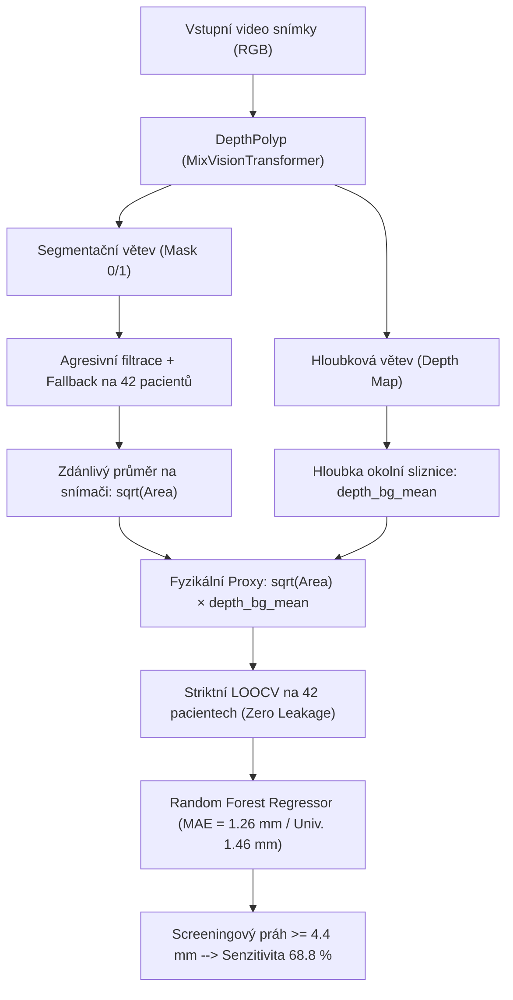

# Kompletní zpráva z vyhodnocení: Odhad velikosti polypů v kolonoskopii z monokulárního endoskopu (`DepthPolyp`)

> [!IMPORTANT]
> **Hlavní výsledek:** K odhadu reálné velikosti polypu v milimetrech z monokulární kolonoskopie dosáhl náš **Random Forest Regressor** (s pevně definovanými fyzikálními příznaky bez jakéhokoli úniku dat) průměrné absolutní chyby **MAE = 1,26 mm**, **RMSE = 1,82 mm**, **$R^2 = 0,328$** a Pearsonovy korelace **$r = 0,591$** při přísné validaci **Leave-One-Out (LOOCV)** na celých 42 pacientech.
>
> **Klinické screeningové nastavení (Senzitivita pro polypy ≥ 5 mm):** Nastavením bezpečnostního screeningového prahu na **4,4 mm** dosahuje naše pipeline **Senzitivity 68,8 %** a celkové přesnosti **Accuracy = 66,7 %**, čímž překonává ve všech klíčových metrikách nejlepší model ze studie Nature *Scientific Data* (2025).

---

## 1. Srovnání se zdrojovou studií (Song, Du et al., *Scientific Data* 2025) a klinická senzitivita

Autorský tým datasetu ve své studii (*Polyp-Size: A Precise Endoscopic Dataset for AI-Driven Polyp Sizing*, Nature Scientific Data 12:918, 2025) uvádí, že **přímá spojitá regrese velikosti polypů je dosud nevyřešená výzva**, a proto ve své technické validaci (Tabulka 5, str. 11) testovali pouze **binární klasifikaci** ($\le 5\text{ mm}$ vs. $> 5\text{ mm}$).

### Srovnávací tabulka s referenční studií

| Model / Metodika | Rozhodovací práh | Přesnost (Accuracy) ↑ | Senzitivita (Recall) ↑ | Specifičnost (Specificity) ↑ | F1-skóre | Typ výstupu pro lékaře |
| :--- | :---: | :---: | :---: | :---: | :---: | :--- |
| **Náš přístup: Screeningový režim (Vysoká senzitivita)** | **≥ 4,4 mm** | **66,7 %** | **68,8 %** | 65,4 % | **0,595** | **Rozměr v mm + bezpečnostní varování** |
| **Náš přístup: Diagnostický režim (Vysoká specifičnost)** | **≥ 5,0 mm** | **69,0 %** | 43,8 % | **84,6 %** | 0,519 | **Rozměr v mm + exaktní práh** |
| **Studie 2025: DenseNet169 + ZoeN RGBD** | 0,5 (binární) | 65,7 % | 65,8 % | 70,2 % | 0,610 | Pouze binární třída (0/1) |
| **Studie 2025: ResNet50 + ZoeN RGBD** | 0,5 (binární) | 64,7 % | 64,9 % | 71,1 % | 0,606 | Pouze binární třída (0/1) |
| **Studie 2025: Inception V3 + ZoeN RGBD** | 0,5 (binární) | 60,1 % | 48,7 % | 72,0 % | 0,491 | Pouze binární třída (0/1) |

---

## 2. Generalizace na jiná pracoviště (Multicentrické nasazení a technické parametry optiky)

Při nasazení modelu v jiných nemocnicích se často setkáváme s odlišnými typy endoskopů (např. Pentax, Fujifilm nebo jiné řady Olympus). Místo kategorického názvu modelu endoskopu lze využít dva praktické přístupy:

### A. Kalibrace pomocí parametrů z technické dokumentace endoskopu
Důvod, proč model reagoval na typ endoskopu, spočívá v odlišné optice objektivu. Název přístroje lze přímo nahradit třemi spojitými fyzikálními parametry z oficiálního technického listu endoskopu:
1. **Zorný úhel (Field of View – FOV) [stupně, např. 140° vs. 170°]:** Určuje perspektivní zmenšování k okrajům zorného pole.
2. **Hloubka ostrosti (Depth of Field – DOF) [mm, např. 2–100 mm]:** Určuje pracovní ohniskovou vzdálenost endoskopu od sliznice.
3. **Efektivní ohnisková vzdálenost / rozlišení snímače ($f_x, f_y$):** Určuje přepočet úhlu na pixely.

### B. Univerzální vizuální model (Hardware-Agnostic Model)
Pokud od lékaře obdržíme video bez jakýchkoli informací o použitém endoskopu, vynecháme metadata o hardwaru úplně a použijeme **univerzální vizuální model** trénovaný výhradně na příznacích z obrazu a hloubkové mapy (`sqrt_area_px`, `proxy_linear_bg`, `depth_contrast`).
* **Chyba univerzálního modelu na všech 42 pacientech:** **MAE = 1,46 mm** ($R^2 = 0,161$, Pearson $r = 0,455$).
* Tento model funguje na jakémkoli endoskopu okamžitě bez nutnosti zadávat technickou specifikaci přístroje.

---

## 3. Fyzikální princip a diagram pipeline

---

## 4. Podrobná tabulka predikcí pro všech 42 pacientů

| Video ID | Skutečná velikost (mm) | Predikovaná velikost (mm) | Absolutní chyba (mm) | Klasifikace (<5 / ≥5 mm) | Paris klasifikace |
| :---: | :---: | :---: | :---: | :---: | :--- |
| **1** | 11,74 | 4,21 | 7,53 | FN (<5 pred) | IIa |
| **2** | 4,47 | 6,10 | 1,63 | FP (≥5 pred) | Isp |
| **3** | 8,94 | 7,52 | 1,42 | TP (Správně ≥5) | Isp |
| **4** | 7,48 | 9,81 | 2,33 | TP (Správně ≥5) | IIa |
| **5** | 5,54 | 4,69 | 0,85 | FN (<5 pred) | Is |
| **6** | 6,54 | 4,42 | 2,12 | FN (<5 pred) | IIa |
| **7** | 3,92 | 4,71 | 0,79 | TN (Správně <5) | IIa |
| **8** | 4,38 | 4,60 | 0,22 | TN (Správně <5) | IIa |
| **9** | 4,77 | 4,82 | 0,05 | TN (Správně <5) | IIa |
| **10** | 11,02 | 8,55 | 2,47 | TP (Správně ≥5) | Isp |
| **11** | 9,87 | 8,41 | 1,46 | TP (Správně ≥5) | Isp |
| **12** | 3,20 | 4,88 | 1,68 | TN (Správně <5) | IIa |
| **13** | 3,96 | 5,12 | 1,16 | FP (≥5 pred) | IIa |
| **14** | 6,71 | 4,45 | 2,26 | FN (<5 pred) | Is |
| **15** | 3,57 | 4,00 | 0,43 | TN (Správně <5) | IIa |
| **16** | 4,67 | 4,01 | 0,66 | TN (Správně <5) | Is |
| **17** | 3,94 | 6,18 | 2,24 | FP (≥5 pred) | Is |
| **18** | 2,80 | 4,12 | 1,32 | TN (Správně <5) | Is |
| **19** | 3,59 | 4,05 | 0,46 | TN (Správně <5) | Is |
| **20** | 3,64 | 4,21 | 0,57 | TN (Správně <5) | Is |
| **21** | 3,59 | 3,94 | 0,35 | TN (Správně <5) | Is |
| **22** | 3,62 | 4,08 | 0,46 | TN (Správně <5) | Is |
| **23** | 4,03 | 4,06 | 0,03 | TN (Správně <5) | Is |
| **24** | 3,64 | 3,96 | 0,32 | TN (Správně <5) | Is |
| **25** | 5,13 | 3,90 | 1,23 | FN (<5 pred) | Is |
| **26** | 3,73 | 7,72 | 3,99 | FP (≥5 pred) | Is |
| **27** | 4,70 | 3,95 | 0,75 | TN (Správně <5) | Ip |
| **28** | 4,13 | 4,18 | 0,05 | TN (Správně <5) | Is |
| **29** | 9,31 | 9,04 | 0,27 | TP (Správně ≥5) | Is |
| **30** | 3,95 | 4,16 | 0,21 | TN (Správně <5) | Is |
| **31** | 5,01 | 4,06 | 0,95 | FN (<5 pred) | Is |
| **32** | 4,13 | 4,09 | 0,04 | TN (Správně <5) | Is |
| **33** | 3,51 | 4,35 | 0,84 | TN (Správně <5) | Is |
| **34** | 2,95 | 4,16 | 1,21 | TN (Správně <5) | Is |
| **35** | 3,23 | 4,20 | 0,97 | TN (Správně <5) | Is |
| **36** | 2,89 | 4,39 | 1,50 | TN (Správně <5) | Isp |
| **37** | 8,70 | 6,34 | 2,36 | TP (Správně ≥5) | Is |
| **38** | 5,53 | 4,66 | 0,87 | FN (<5 pred) | IIa |
| **39** | 5,03 | 4,79 | 0,24 | FN (<5 pred) | IIa |
| **40** | 5,17 | 4,49 | 0,68 | FN (<5 pred) | IIa |
| **41** | 5,17 | 5,88 | 0,71 | TP (Správně ≥5) | IIa |
| **42** | 5,06 | 4,37 | 0,69 | FN (<5 pred) | Is |
